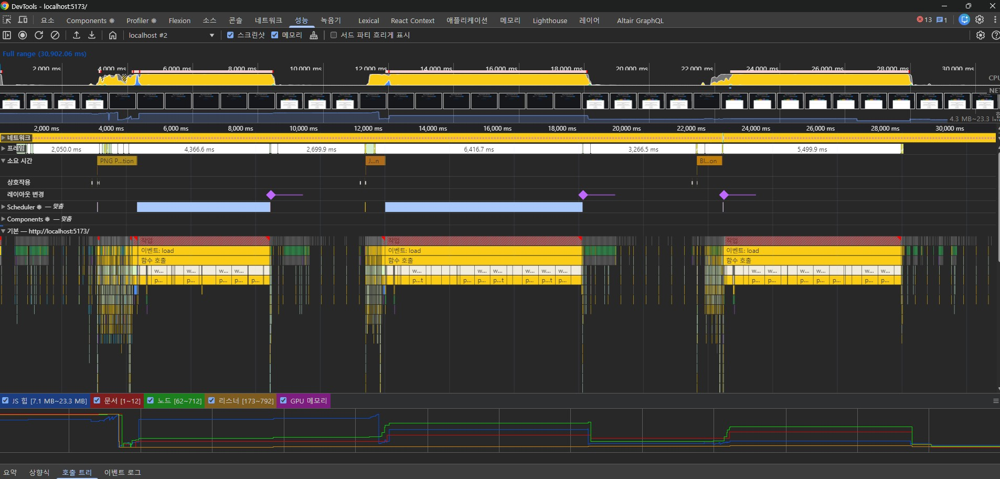

# 🖨️ PDF 인쇄 구현 전략 가이드

이 문서는 PDF 데이터를 인쇄할 때 상황에 맞는 두 가지 핵심 구현 전략(Canvas 렌더링 vs HTML 추출)을 비교하고 가이드합니다.

---

## 1. 전략 A: Canvas 기반 고화질 렌더링 (`getPage` 활용)

PDF의 레이아웃, 이미지, 그래픽 요소를 원본과 100% 동일하게 유지해야 할 때 사용하는 방식입니다.

### ✅ 구현 흐름
1.  **전체 페이지 순회**: `pdfDoc.numPages`를 활용해 모든 페이지를 비동기 루프로 처리합니다.
2.  **고해상도 뷰포트 설정**: 인쇄 시 선명도를 위해 `scale: 2.0` 이상을 권장합니다.
3.  **오프스크린 렌더링**: 화면에 보이지 않는 임시 Canvas를 생성하여 `page.render()`를 실행합니다.
4.  **이미지화 또는 직접 삽입**: 렌더링된 Canvas를 `toDataURL()`로 이미지화하거나, Canvas 객체 자체를 인쇄 전용 컨테이너에 추가합니다.

### 💻 핵심 코드 예시
```javascript
async function prepareCanvasPrint(pdfDoc) {
  const container = document.getElementById('print-area');
  
  for (let i = 1; i <= pdfDoc.numPages; i++) {
    const page = await pdfDoc.getPage(i);
    const viewport = page.getViewport({ scale: 2.0 }); // 고해상도
    
    const canvas = document.createElement('canvas');
    const context = canvas.getContext('2d');
    canvas.width = viewport.width;
    canvas.height = viewport.height;
    
    await page.render({ canvasContext: context, viewport }).promise;
    container.appendChild(canvas);
  }
}
```

### 🎨 CSS 팁
```css
@media print {
  canvas {
    page-break-after: always; /* 페이지별 강제 줄바꿈 */
    max-width: 100%;
    height: auto;
  }
}
```

---

## 2. 전략 B: HTML/TextLayer 기반 스타일 가공

인쇄 전 텍스트 내용을 수정(Replace)하거나, CSS를 통해 폰트, 색상 등 디자인을 자유롭게 조정해야 할 때 적합합니다.

### ✅ 구현 흐름
1.  **텍스트 데이터 추출**: `page.getTextContent()`를 통해 PDF 내 텍스트와 좌표 정보를 가져옵니다.
2.  **데이터 치환**: 획득한 데이터 객체 내부의 문자열(`item.str`)을 정규식 등으로 수정합니다.
3.  **TextLayer 렌더링**: 수정된 데이터를 `pdfjsLib.TextLayer`에 전달하여 HTML 구조를 생성합니다.
4.  **CSS 오버라이드**: 생성된 HTML(`span` 태그들)에 커스텀 스타일을 적용하여 최종 인쇄본을 만듭니다.

### 💻 핵심 코드 예시
```javascript
async function prepareHtmlPrint(page) {
  const textContent = await page.getTextContent();
  
  // 데이터 가공 (예: 기밀 정보 마스킹)
  textContent.items.forEach(item => {
    item.str = item.str.replace("비공개", "******");
  });

  const container = document.createElement('div');
  container.className = 'textLayer'; // PDF.js 기본 CSS 클래스 활용
  
  const textLayer = new pdfjsLib.TextLayer({
    textContentSource: textContent,
    container: container,
    viewport: page.getViewport({ scale: 1.5 })
  });
  
  await textLayer.render();
  return container.innerHTML; // 가공된 HTML 반환
}
```

---

## 3. 전략 C: 이미지 변환 인쇄 (세부 옵션)

Canvas 객체를 직접 인쇄하는 대신, 다양한 형식의 이미지로 변환하여 새 창에서 인쇄하는 방식입니다.

### 1) PNG/JPG 스트링 방식 (DataURL / Base64)
*   **패턴**: **값(Value) 전달 방식**
*   **특징**: 이진 데이터를 텍스트 문자열로 인코딩하여 직접 전달.
*   **성능 분석 (Trace 결과)**:
    *   **메모리**: JS Heap 메모리에 거대한 문자열이 직접 할당되어 점유율이 매우 높음 (PNG > JPG).
    *   **소요 시간**: 인코딩/디코딩 연산 부하로 인해 소요 시간이 가장 김 (약 1.2s+).
*   **비유**: 책 한 권의 내용을 전부 외워서 남에게 읊어주는 방식.

### 2) Blob 객체 방식 (ObjectURL / Binary)
*   **패턴**: **참조(Reference) 전달 방식**
*   **특징**: 데이터를 브라우저 네이티브 메모리에 보관하고, JS는 짧은 주소(URL)만 관리.
*   **성능 분석 (Trace 결과)**:
    *   **메모리**: 실제 데이터는 JS 외부(Native) 영역에 있어 **JS Heap 점유율이 매우 낮음 (최적)**.
    *   **소요 시간**: 인코딩 과정이 생략되어 처리 속도가 빠르고 안정적 (약 0.7s~0.8s).
*   **비유**: 물건이 보관된 창고 번호표(주소)만 전달하는 방식.

---

## 4. 전략 및 데이터 형식 비교 요약


*그림: PNG(Base64) vs JPG(Base64) vs Blob(Binary) 성능 트레이스 비교*

| 비교 항목 | **Base64 (PNG/JPG)** | **Binary (Blob)** |
| :--- | :--- | :--- |
| **데이터 본질** | 텍스트(String)화된 데이터 | 순수 이진 데이터 (덩어리) |
| **메모리 패턴** | **값(Value)**에 의한 전달 | **참조(Reference)**에 의한 전달 |
| **JS Heap 부하** | 높음 (GC 관리 부담 증가) | **낮음 (최상)** |
| **CPU 연산** | 인코딩/디코딩 부하 발생 | 연산 거의 없음 (직접 처리) |
| **뒷정리** | 가비지 컬렉터가 자동 처리 | **`revokeObjectURL()`로 수동 반납 권장** |

### 🔍 트레이스 데이터 기반 상세 분석 (perf_capture.jpg)
1.  **Heap Memory Profile**:
    *   **PNG/JPG 구간**: 힙 메모리가 계단식으로 급격히 상승하는 산맥 형태를 보입니다. 이는 대용량 문자열이 JS 엔진 내부에 직접 적재되었음을 증명합니다.
    *   **Blob 구간**: 메모리 그래프가 바닥에 붙어 평탄하게 유지됩니다. 데이터가 엔진 외부(Native)에 있고 주소값만 관리하기 때문에 발생하는 압도적인 효율성입니다.
2.  **Task Duration**:
    *   PNG의 경우 인코딩 연산으로 인해 타임라인의 Task Bar가 가장 길게 형성되었습니다 (측정치: 약 1.2s).
    *   Blob은 가공 연산이 거의 없어 Task 간격이 매우 짧고 즉각적입니다 (측정치: 약 0.7~0.8s).

---

## 5. 하이브리드 전략: 상황별 최적화 가이드 (Hybrid Strategy)

실무 환경에서는 성능(메모리)과 호환성(전송)을 모두 잡기 위해 상황에 따라 두 방식을 섞어 사용하는 것이 가장 권장됩니다.

### 🚀 상황별 기술 선택 (Decision Matrix)

| 시나리오 | 권장 기술 | 데이터 패턴 | 핵심 이유 |
| :--- | :--- | :--- | :--- |
| **즉시 인쇄 (Print)** | **Blob (Binary)** | **참조 (Reference)** | 수백 페이지 인쇄 시에도 **브라우저 크래시 방지**, 메모리 효율 극대화. |
| **이메일 본문/팩스 발송** | **JPG (Base64)** | **값 (Value)** | 외부 메일 앱에서도 이미지가 보이도록 **HTML 내 데이터 내장**, 용량 다이어트 필수. |
| **고화질 아카이빙** | **PNG (Base64)** | **값 (Value)** | 손실 없는 화질로 문서를 영구 보관해야 할 때 사용. (단, 파일 용량이 매우 커짐) |
| **웹드라이버 스크래핑** | **JPG (Base64)** | **값 (Value)** | 주소가 아닌 **데이터 자체를 캡처**해야 전송 시 이미지가 유실되지 않음. |
| **오프라인 파일 저장** | **PNG (Base64)** | **값 (Value)** | 단일 HTML 파일만으로 언제 어디서든 고화질 문서를 볼 수 있게 함. |

### 💡 왜 섞어 써야 하나요?
1.  **내부 작업 (Internal)**: 내 브라우저 메모리 안에서 끝나는 일은 **Blob**이 압도적으로 빠르고 가볍습니다.
2.  **외부 전송 (External)**: 데이터가 브라우저 밖으로 나가는 순간 `blob:` 주소는 무용지물이 됩니다. 이때는 무겁더라도 데이터 자체가 박혀 있는 **Base64**가 필수이며, 전송 효율을 위해 **JPG 압축** 또는 화질을 위한 **PNG**를 선택합니다.

---

## 7. 사용 형태별 최적화 가이드 (Scale & Format 가이드)

PDF를 이미지로 변환할 때 배율(Scale)과 포맷(Format)의 조합은 **시각적 품질**과 **데이터 전송 안정성**을 결정짓는 핵심 요소입니다.

### 📊 사용 목적별 권장 세팅 (Standard Recommendation)

| 사용 형태 | 추천 배율 (Scale) | 추천 포맷 | 핵심 목표 |
| :--- | :---: | :--- | :--- |
| **A4 비즈니스 인쇄** | **1.5** | **JPG (0.8)** | **골든 스탠다드**: 본 화면과 출력물이 동일한 품질을 유지하며 용량 최적화. |
| **고화질 아카이빙** | **2.0 이상** | **PNG** | **무손실 보관**: 텍스트와 그래픽의 단 1% 손실도 허용하지 않는 영구 보관용. |
| **이메일/모바일 전송** | **1.2** | **JPG (0.6)** | **전송 안정성**: 모바일 환경에서 즉시 로딩되도록 문자열 길이를 극단적으로 다이어트. |
| **팩스(Fax) 전용** | **1.0** | **JPG (0.5)** | **저속망 최적화**: 팩스 규격(200 DPI 이하)에 맞춘 초경량화 및 전송 성공률 확보. |
| **화면 썸네일** | **0.3 ~ 0.5** | **JPG (0.4)** | **메모리 절약**: 형체만 확인하는 용도로 JS Heap 부하를 최소화. |

### 💡 기술적 판단 근거 (Rationale)

1.  **배율(Scale)과 용량의 관계**: 
    *   용량은 배율의 **제곱**에 비례합니다. (Scale 1.5는 1.0 대비 2.25배의 픽셀을 생성)
    *   Scale 1.5는 약 **108 DPI**에 해당하며, 이는 일반적인 A4 서식 출력 시 글자가 뭉개지지 않는 최적의 해상도입니다.

2.  **포맷(Format)과 문자열 길이**:
    *   Base64 인코딩 시 데이터는 원본보다 **약 33% 커집니다.**
    *   JPG(0.8)는 PNG 대비 문자열 길이를 **60% 이상 단축**시키면서도, 사람의 눈으로 식별하기 어려운 수준의 고화질을 유지합니다.

3.  **사용자 경험(UX) 균형**:
    *   "본 것과 뽑은 것이 같다"는 신뢰를 주기 위해 **Scale 1.5 + JPG 0.8** 조합을 비즈니스 표준으로 권장합니다.
    *   단, 외부 전송(Email/Fax) 시스템 연동 시에는 시스템 부하를 고려하여 **'전송 최적화 옵션(Scale 1.2)'**을 제공하는 것이 전문적인 설계 방향입니다.

---

## 8. 최종 요약

*   **내부용 (인쇄/조회)**: **Scale 1.5 + Blob** 방식을 사용하여 성능과 화질을 동시에 잡으십시오.
*   **외부용 (공유/전송)**: **Scale 1.5 + JPG(0.8) Base64**를 기본으로 하되, 대량 전송 시 **Scale 1.2**로의 조절을 고려하십시오.

---

## 4. 통합 권장사항

1.  **인쇄 전 전용 창(Popup) 사용**: `window.open()`을 통해 인쇄 전용 페이지를 띄우면 메인 앱의 상태(State)를 오염시키지 않고 깔끔하게 인쇄 로직을 수행할 수 있습니다.
2.  **비동기 처리 주의**: 모든 페이지의 렌더링(`Canvas`든 `TextLayer`든)이 완전히 끝난 후 `window.print()`를 호출해야 누락되는 페이지가 없습니다.
3.  **폰트 로딩**: HTML 방식 사용 시, 인쇄용 시스템에 해당 폰트가 없으면 레이아웃이 깨질 수 있으므로 웹 폰트(Web Font)를 함께 임베딩하는 것이 안전합니다.
